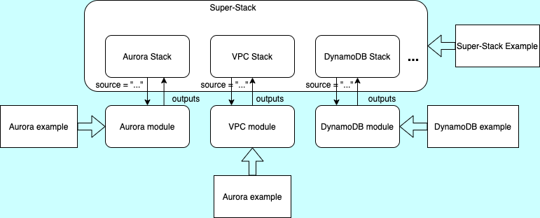
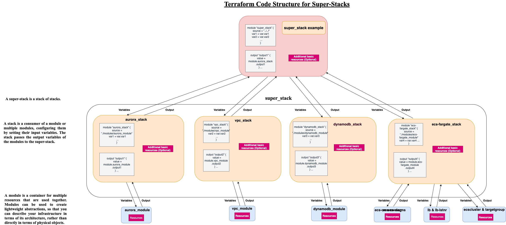

# Super-Stack

A module is a container for multiple resources (with their input and output variables) that are used together. Modules can be used to create lightweight abstractions, so that you can describe your infrastructure in terms of its architecture, rather than directly in terms of physical objects.

A stack can be seen as code leveraging modules and additional resources to deploy infrastructure for a layer, e.g. storage or compute.

Here we call a stack of stacks **"Super-Stack"** and allow consumers to deploy complete applications just by setting the appropriate input variables.

